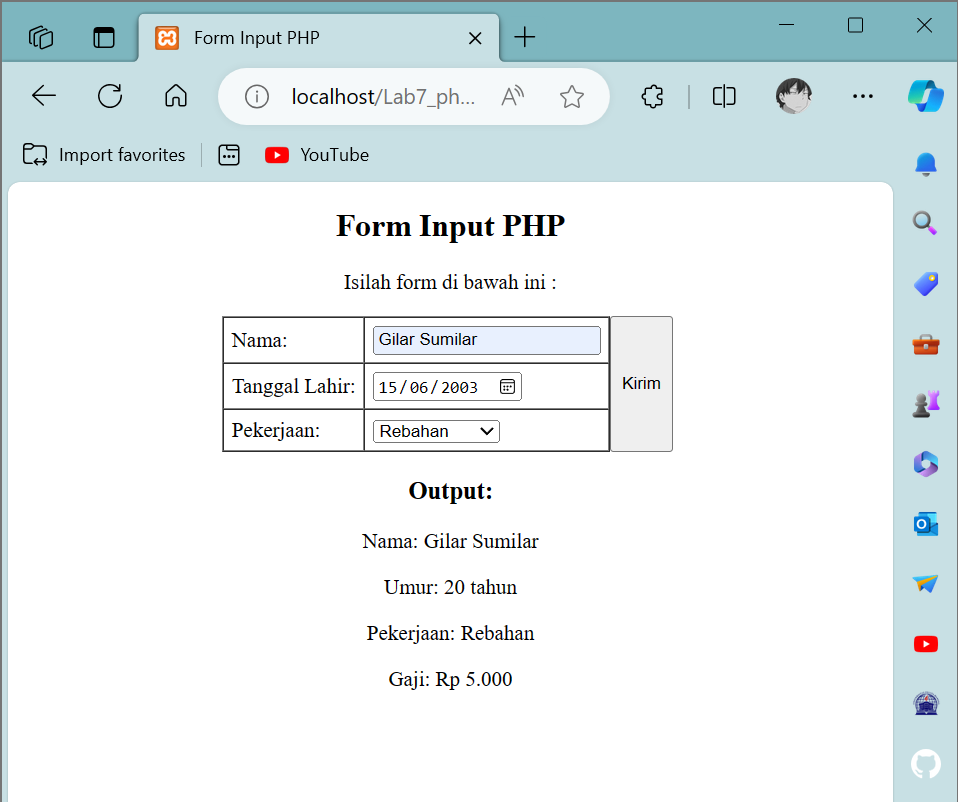
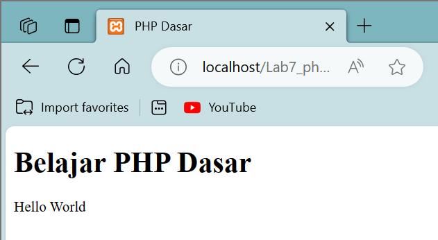
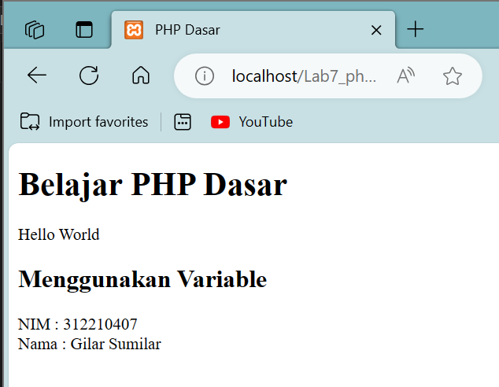
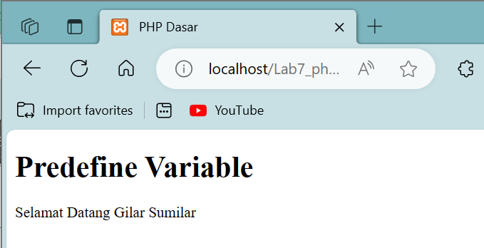
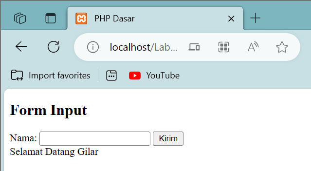
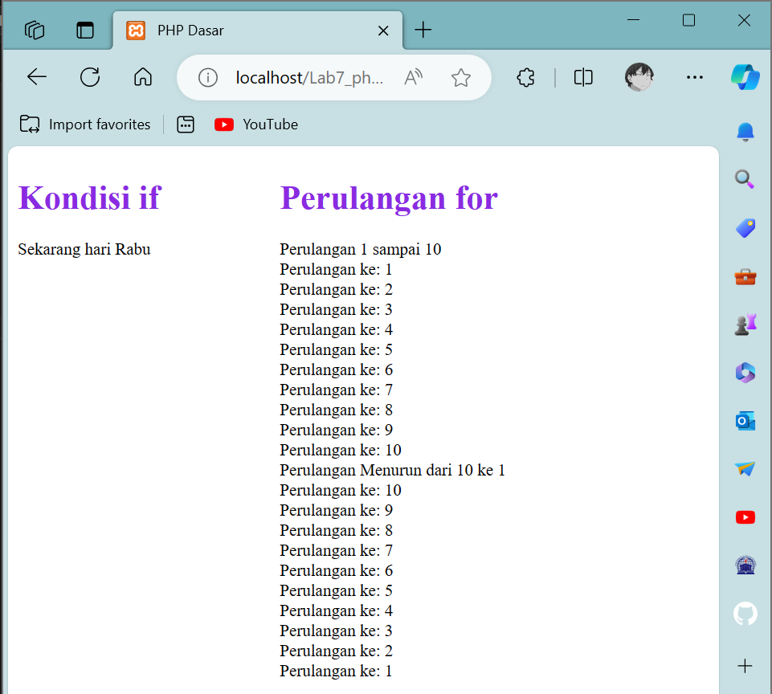

# Lab7Web + PHP
## Profil
| Variable | Isi |
| -------- | --- |
| **Nama** | Gilar Sumilar |
| **NIM** | 312210407 |
| **Kelas** | TI.22.A4 |
| **Mata Kuliah** | Pemrograman WEB |

### Instruksi Praktikum
1. Buatlah repository baru dengan nama Lab7Web.
2. Kerjakan semua latihan yang diberikan sesuai urutannya.
3. Screenshot setiap perubahannya.
4. Buatlah file README.md dan tuliskan penjelasan dari setiap langkah praktikum 
beserta screenshotnya.
5. Commit hasilnya pada repository masing-masing.
6. Kirim URL repository pada e-learning ecampu

### Pertanyaan dan Tugas
Buatlah program PHP sederhana dengan menggunakan form input yang menampilkan 
nama, tanggal lahir dan pekerjaan. Kemudian tampilkan outputnya dengan menghitung 
umur berdasarkan inputan tanggal lahir. Dan pilihan pekerjaan dengan gaji yang 
berbeda-beda sesuai pilihan pekerjaan.

### Jawaban : [Sourcecode](https://github.com/GilarSumilar/Lab7Web/blob/main/php_dasar.php)

**Hasil tugas :**




# Langkah-langkah Praktikum
## PHP Dasar
```HTML
<!DOCTYPE html>
<html lang="en">

<head>
    <meta charset="UTF-8">
    <title>PHP Dasar</title>
</head>

<body>
    <h1>Belajar PHP Dasar</h1>
    <?php
    echo "Hello World";
    ?>
</body>

</html>
```
**Hasil :**



#### *Note :*


## Variable PHP
```HTML
<!DOCTYPE html>
<html lang="en">

<head>
    <meta charset="UTF-8">
    <title>PHP Dasar</title>
</head>

<body>
    <h1>Belajar PHP Dasar</h1>
    <?php
    echo "Hello World";
    ?>
    <h2>Menggunakan Variable</h2>
    <?php
    $nim = "312210407";
    $nama = 'Gilar Sumilar';
    echo "NIM : " . $nim . "<br>";
    echo "Nama : $nama";
    ?>
</body>

</html>
```
**Hasil :**




#### *Note :*
Menambahkan variable pada program.

## Predefine Variable $_GET
```HTML
<!DOCTYPE html>
<html lang="en">

<head>
    <meta charset="UTF-8">
    <title>PHP Dasar</title>
</head>

<body>
    <h1>Predefine Variable</h1>
    <?php
    echo 'Selamat Datang ' . $_GET['nama'];
    ?>
</body>

</html>
```
**Hasil :**



#### *Note :*
Dalam PHP, `$_GET` adalah salah satu variabel global yang digunakan untuk mengumpulkan data yang dikirimkan ke skrip PHP melalui metode HTTP GET.
Metode GET digunakan untuk mengirimkan data melalui URL, dan `$_GET` membantu dalam menangkap dan memanipulasi data tersebut di dalam skrip PHP.

## Membuat Form Input
```HTML
Membuat Form Input
<!DOCTYPE html>
<html lang="en">

<head>
    <meta charset="UTF-8">
    <title>PHP Dasar</title>
</head>

<body>
    <h2>Form Input</h2>
    <form method="post">
        <label>Nama: </label>
        <input type="text" name="nama">
        <input type="submit" value="Kirim">
    </form>
    <?php
    echo 'Selamat Datang ' . $_POST['nama'];
    ?>
</body>

</html>
```
**Hasil :**



#### *Note :*

## Kondisi If dan Perulangan for
```HTML
<!DOCTYPE html>
<html lang="en">

<head>
    <meta charset="UTF-8">
    <title>PHP Dasar</title>
    <style>
        .container {
            display: flex;
            gap: 100px;
        }

        h1 {
            color: blueviolet;
        }
    </style>
</head>

<body>
    <div class="container">
        <div class="1">
            <h1>Kondisi if</h1>
            <?php
            $nama_hari = date("l");
            if ($nama_hari == "Sunday") {
                echo "Minggu";
            } elseif ($nama_hari == "Monday") {
                echo "Sekarang hari Senin";
            } elseif ($nama_hari == "Tuesday") {
                echo "Sekarang hari Selasa";
            } elseif ($nama_hari == "Wednesday") {
                echo "Sekarang hari Rabu";
            } elseif ($nama_hari == "Thursday") {
                echo "Sekarang hari Kamis";
            } elseif ($nama_hari == "Friday") {
                echo "Sekarang hari Jum'at";
            } else {
                echo "Sekarang hari Sabtu";
            }
            ?>
        </div>
        <div class="2">
            <h1>Perulangan for</h1>
            <?php
            echo "Perulangan 1 sampai 10 <br />";
            for ($i = 1; $i <= 10; $i++) {
                echo "Perulangan ke: " . $i . '<br />';
            }
            echo "Perulangan Menurun dari 10 ke 1 <br />";
            for ($i = 10; $i >= 1; $i--) {
                echo "Perulangan ke: " . $i . '<br />';
            }
            ?>
        </div>
    </div>
</body>

</html>
```
**Hasil :**



#### *Note :*
Menggabungkan tugas membuat kondisi if dan perulangan for secara menyamping.

**[---KEMBALI-->](#Profil)**
